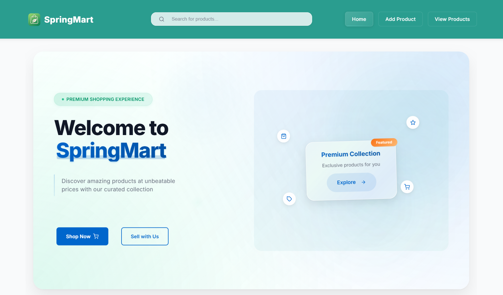
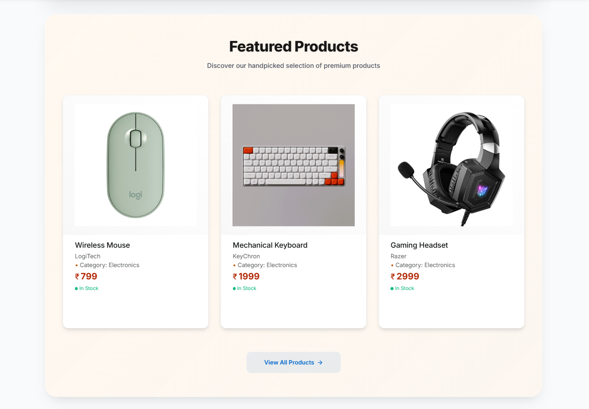
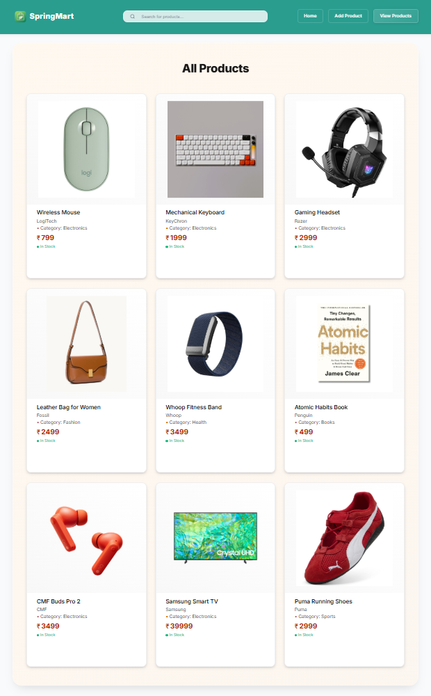
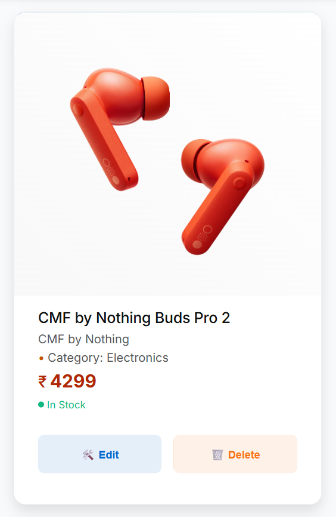
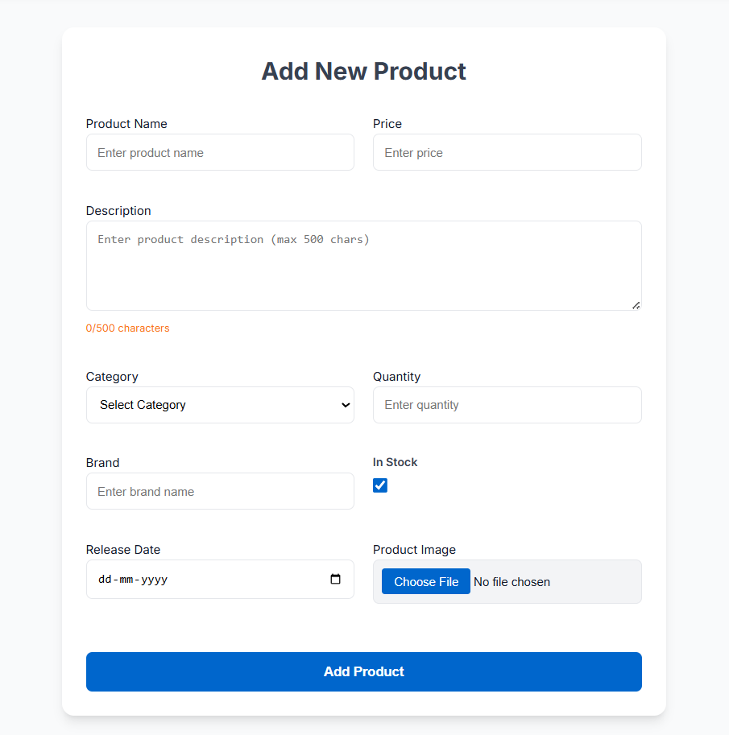

# 🛒 SpringMart

A modern, full-stack e-commerce platform.

---

## 🛠️ Project Summary

**Project Name:** SpringMart  
**Tech Stack:**

- **Backend:** Spring Boot (Java) – Core logic & data operations
- **Frontend:** React – UI and user-facing interactions

---

## ✨ App Screenshots

<div align="center">

<table>
  <tr>
    <td align="center" style="padding: 24px 32px;">
      
      <div style="margin-top:8px;"><b>Home Page</b></div>
    </td>
    <td align="center" style="padding: 24px 32px;">
      
      <div style="margin-top:8px;"><b>Featured Products</b></div>
    </td>
  </tr>
  <tr>
    <td align="center" style="padding: 24px 32px;">
      
      <div style="margin-top:8px;"><b>All Products List</b></div>
    </td>
    <td align="center" style="padding: 24px 32px;">
      
      <div style="margin-top:8px;"><b>Product Card</b></div>
    </td>
  </tr>
  <tr>
    <td align="center" colspan="2" style="padding: 24px 32px;">
      
      <div style="margin-top:8px;"><b>Add Product Form</b></div>
    </td>
  </tr>
</table>

</div>

---

## 🎨 Frontend Guidelines

- **Design Aesthetic:**
  - Clean, minimal, and premium
  - Inspires trust and modern polish
- **UX Focus:**
  - Smooth, intuitive navigation
  - Clear product presentation, frictionless interaction
- **Integration:**
  - Fully synced with backend APIs
  - Handles errors gracefully

---

## ⚙️ Backend Specifications

- **Tech Stack:**
  - Spring Boot `v3.4.5`, Java `21`
  - H2 database (can be swapped for any JPA-compatible DB)
- **Architecture:**
  - RESTful API structure
  - Main components:
    - `Product` entity
    - `ProductController` – handles HTTP requests
    - `ProductService` – business logic (CRUD & search)
    - `ProductRepo` – DB layer (JPA repository)

---

## 🔌 API Overview

**Base URL:** `/api`

| Endpoint               | Method | Description            | Params / Responses                            |
| ---------------------- | ------ | ---------------------- | --------------------------------------------- |
| `/`                    | GET    | Welcome message        | `200 OK`                                      |
| `/products`            | GET    | Paginated product list | `page`, `size`; `200 OK` / `204 No Content`   |
| `/products/{id}`       | GET    | Get product by ID      | `id`; `200 OK` / `404 Not Found`              |
| `/products/image/{id}` | GET    | Retrieve product image | `id`; returns image binary / `404`            |
| `/products/search`     | GET    | Search by keyword      | `keyword`; `200 OK` / `204 No Content`        |
| `/products`            | POST   | Add a new product      | Multipart JSON + image; `201` / `400` / `500` |
| `/products/{id}`       | PUT    | Update product by ID   | `id` + updated data; `200 OK` / `404`         |
| `/products/{id}`       | DELETE | Remove product by ID   | `id`; `204 No Content` / `404 Not Found`      |

---

## 🧩 Product Entity Structure

- **Required Fields:**
  - `name` (String)
  - `price` (Integer ≥ 0)
  - `category` (String)
  - `brand` (String)
- **Optional Fields:**
  - `description` (String ≤ 500 chars)
  - `quantity` (Integer ≥ 0)
  - `inStock` (Boolean)
  - `releaseDate` (Date)
  - `imageName`, `imageType`, `imageData` (for image storage)

---

## 🧠 Business Logic Summary

- **Core Features:**
  - Full CRUD support
  - Image upload/download
  - Search across name, description, category, brand
- **Validation:**
  - Javax annotations (`@NotBlank`, `@Min`, etc.)
  - Error responses: `400 Bad Request` for invalid inputs
- **CORS Policy:**
  - Configured via `@CrossOrigin` to allow `localhost:3000` (React) to access `localhost:8080` (Spring Boot)

---

## 🚀 Getting Started

### Prerequisites

- Java 21
- Node.js (v18+ recommended) & npm

### Backend Setup

1. Open a terminal and navigate to the backend directory:
   ```sh
   cd springmart-backend/springmart
   ```
2. Start the Spring Boot server:
   ```sh
   ./mvnw spring-boot:run
   ```
   Or on Windows:
   ```sh
   mvnw.cmd spring-boot:run
   ```
3. The backend runs on [http://localhost:8080](http://localhost:8080) by default.

### Frontend Setup

1. Open a new terminal and navigate to the frontend directory:
   ```sh
   cd springmart-frontend
   ```
2. Install dependencies:
   ```sh
   npm install
   ```
3. Start the React app:
   ```sh
   npm start
   ```
4. The frontend runs on [http://localhost:3000](http://localhost:3000) by default.

---

## 📝 Development Notes

- **Backend:** Use IntelliJ IDEA or your preferred Java IDE.
- **Frontend:** Use VS Code or your preferred JS editor.
- **H2 Console:** Access at [http://localhost:8080/h2-console](http://localhost:8080/h2-console) (JDBC URL: `jdbc:h2:file:./data/springmartdb`)
- **Demo Data:** The backend loads demo products and images on first run if the DB is empty.
- **CORS:** Pre-configured for local development.

---

## 🔑 Final Requirements

- Follow REST best practices across all API interactions
- Keep UI minimal yet polished and professional
- Ensure smooth user experience from frontend to backend
- Confirm CORS is functioning correctly for cross-origin access

---

📌 _Refer to the codebase for implementation specifics if needed during development._
