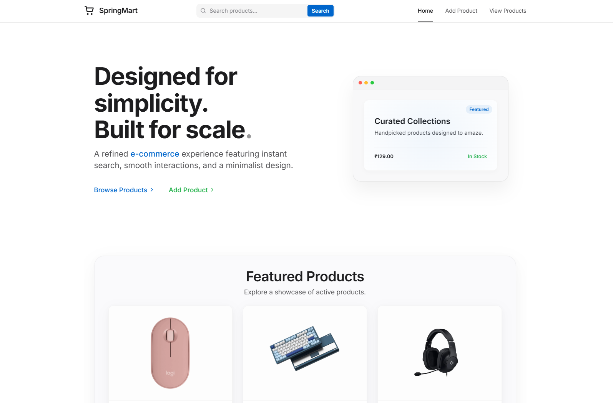
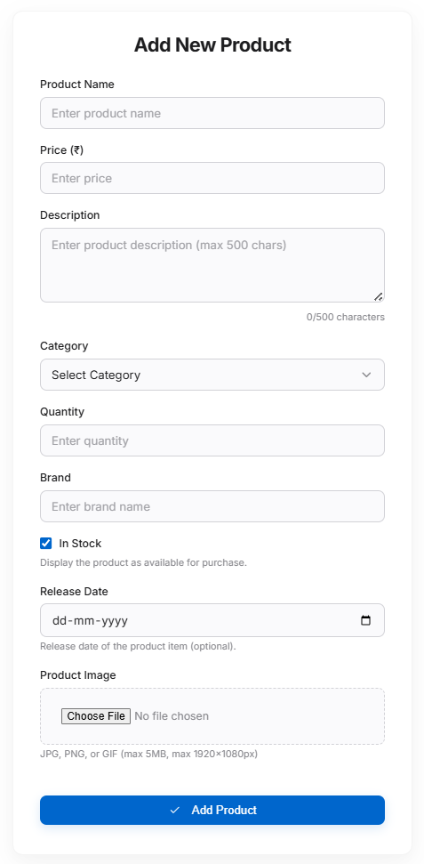

# 🛒 SpringMart

SpringMart is a full-stack e-commerce application with a **Spring Boot** backend and a **React** frontend. It features product management (CRUD), search, paginated listings, and image handling.

---

## ✨ Features

*   **📦 Product CRUD**: Create, view, update, and delete products.
*   **🔍 Keyword Search**: Search across name, description, category, and brand using a custom JPQL query.
*   **🖼️ Image Uploads**: Upload and retrieve product images as raw bytes.
*   **⚡ Pagination**: Paginated listings on both frontend and backend.
*   **🐳 Docker Support**: Run the backend using Docker.

---

## 📸 App Preview

### 🏠 Home Page


*Browse, filter, and search products.*

### 🔍 Product Details


*View product details and images.*

### ➕ Add/Edit Product


*Add or update products with form validation.*

---

## 🛠️ Technology Stack

| Layer | Technologies |
| :--- | :--- |
| **Backend** | Java 21, Spring Boot 3.4.5, Spring Data JPA, H2 Database, Maven |
| **Frontend** | React 19, React Router, Sass, React Toastify, React Icons |
| **Deployment** | Docker, Netlify, Render |

---

## 📁 Project Structure

```text
SpringMart/
├── public/                   # Screenshots and README assets
├── springmart-backend/       # Spring Boot REST API
├── springmart-frontend/      # React Frontend SPA
├── Dockerfile                # Backend Dockerfile
├── docker-compose.yml        # Docker Compose configuration (runs backend)
├── render.yaml               # Render backend deployment settings
└── netlify.toml              # Netlify frontend deployment settings
```

---

## 🚀 Getting Started

### Prerequisites
Requires **Node.js (>=20)** and **Java (21)**.

### 1. Run the Backend
*   **Windows (PowerShell)**:
    ```powershell
    cd springmart-backend
    .\mvnw.cmd spring-boot:run
    ```
*   **macOS / Linux**:
    ```bash
    cd springmart-backend
    chmod +x mvnw
    ./mvnw spring-boot:run
    ```

*   **API Base URL**: `http://localhost:8080`
*   **H2 Console**: `http://localhost:8080/h2-console`
*   *Note: Automatically seeds 9 demo products on startup if the database is empty.*

### 2. Run the Frontend
```bash
cd springmart-frontend
npm install
npm start
```

*   **App URL**: `http://localhost:3000`
*   *Note: Proxy configuration routes API requests to the local backend during development.*

### 3. Run with Docker Compose (Backend only)
```bash
docker compose up --build
```

---

## 🔌 API Reference

Endpoints are prefixed with `/api`:

| Endpoint | Method | Description |
| :--- | :--- | :--- |
| `/api/products` | `GET` | Get a paginated list of products |
| `/api/products/{id}` | `GET` | Get details for a single product |
| `/api/products/search` | `GET` | Search products by name, description, brand, or category |
| `/api/products` | `POST` | Create a new product (handles `multipart/form-data`) |
| `/api/products/{id}` | `PUT` | Update an existing product (handles `multipart/form-data`) |
| `/api/products/{id}` | `DELETE` | Delete a product |
| `/api/products/image/{id}` | `GET` | Retrieve a product's image bytes |

---

## 🏛️ Architecture & Code Design

*   **Layered Design**: Follows `Controller -> Service -> Repository -> JPA Entity`.
*   **DTO mapping**: Maps HTTP requests to DTOs and then to JPA entities.
*   **Business Logic**: Service layer handles validation, updates, and image preservation.
*   **Queries**: Single JPQL query for case-insensitive keyword search.

---

## 🌐 Production Deployment

*   **Backend**: Deployed on Render via `render.yaml`.
*   **Frontend**: Deployed on Netlify via `netlify.toml`.
