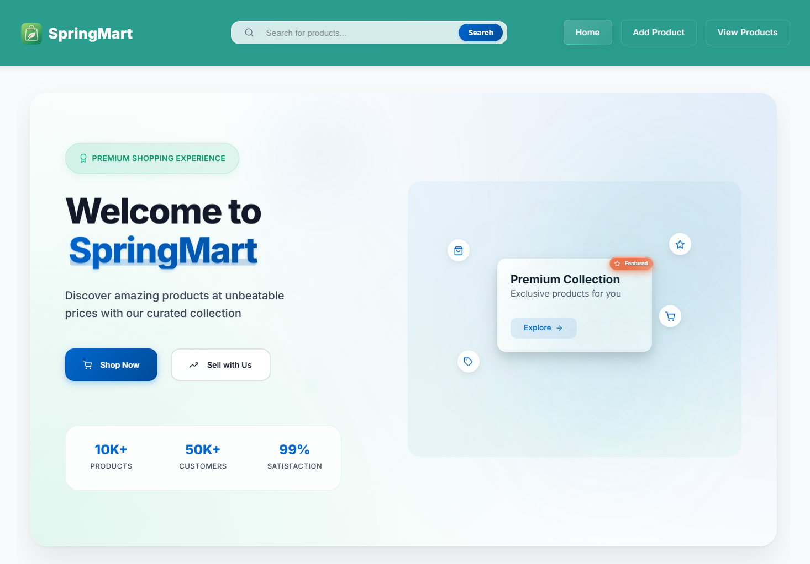

# 🛒 SpringMart

A modern, full-stack e-commerce platform built with **Spring Boot (Java)** and **React**. SpringMart demonstrates robust backend development, RESTful API design, and seamless UI integration. This project is intended for learning and demonstration purposes only.

---

## 🚀 Overview

SpringMart is a **prototype, full-stack showcase project** for learning and demonstration. It features:

- **Backend:** Spring Boot (Java) with H2 database (JPA-compatible)
- **Frontend:** React for a modern, minimal UI
- **RESTful APIs:** For all data operations
- **Demo Data:** Preloaded on first run

---

## 🛠️ Tech Stack


---

## ✨ App Screenshots

> _Sample UI screens from SpringMart in action._

<p align="center">
  
  <br/><sub><b>Home Page</b></sub>
</p>

<p align="center">
  
  <br/><sub><b>Featured Products</b></sub>
</p>

<p align="center">
  
  <br/><sub><b>All Products List</b></sub>
</p>

<p align="center">
  
  <br/><sub><b>Product Card</b></sub>
</p>

<p align="center">
  
  <br/><sub><b>Add Product Form</b></sub>
</p>

---

## 🎨 Design & UX Principles

- **Aesthetic:** Clean, minimal, and premium; inspires trust and modern polish
- **User Experience:** Smooth, intuitive navigation; clear product presentation; frictionless interaction
- **Integration:** Fully synced with backend APIs; handles errors gracefully

---

## ⚙️ Backend Specifications

- **Spring Boot** `v3.4.5`, **Java** `21`
- **H2 database** (JPA-compatible, can be swapped)
- **RESTful API** structure
- **Main components:**
  - `Product` entity
  - `ProductController` – handles HTTP requests
  - `ProductService` – business logic (CRUD & search)
  - `ProductRepo` – DB layer (JPA repository)

---

## 🔌 API Overview

**Base URL:** `/api`

| Endpoint               | Method | Description            | Params / Responses                            |
| ---------------------- | ------ | ---------------------- | --------------------------------------------- |
| `/`                    | GET    | Welcome message        | `200 OK`                                      |
| `/products`            | GET    | Paginated product list | `page`, `size`; `200 OK` / `204 No Content`   |
| `/products/{id}`       | GET    | Get product by ID      | `id`; `200 OK` / `404 Not Found`              |
| `/products/image/{id}` | GET    | Retrieve product image | `id`; returns image binary / `404`            |
| `/products/search`     | GET    | Search by keyword      | `keyword`; `200 OK` / `204 No Content`        |
| `/products`            | POST   | Add a new product      | Multipart JSON + image; `201` / `400` / `500` |
| `/products/{id}`       | PUT    | Update product by ID   | `id` + updated data; `200 OK` / `404`         |
| `/products/{id}`       | DELETE | Remove product by ID   | `id`; `204 No Content` / `404 Not Found`      |

> _All endpoints are public for demonstration. **No authentication is implemented.**_

---

## 🧩 Product Entity Structure

| Field       | Type    | Required | Description                        |
| ----------- | ------- | -------- | ---------------------------------- |
| id          | int     | Auto     | Unique identifier (auto-generated) |
| name        | String  | Yes      | Product name                       |
| price       | Integer | Yes      | Must be ≥ 0                        |
| category    | String  | Yes      | Product category                   |
| brand       | String  | Yes      | Product brand                      |
| description | String  | No       | Max 500 characters                 |
| quantity    | int     | No       | Must be ≥ 0                        |
| inStock     | boolean | No       | Availability                       |
| releaseDate | Date    | No       | Product release date               |
| imageName   | String  | No       | File name of image                 |
| imageType   | String  | No       | MIME type (e.g., image/jpeg)       |
| imageData   | byte[]  | No       | Binary image data                  |

---

## 🧠 Business Logic Summary

- Full CRUD support
- Image upload/download
- Search across name, description, category, brand
- Validation via Javax annotations (`@NotBlank`, `@Min`, etc.)
- Error responses: `400 Bad Request` for invalid inputs
- **CORS Policy:** Configured via `@CrossOrigin` to allow `localhost:3000` (React) to access `localhost:8080` (Spring Boot)

---

## 🚀 Getting Started

### Prerequisites

- Java 21
- Node.js (v18+ recommended) & npm

### Backend Setup

1. Open a terminal and navigate to the backend directory:
   ```sh
   cd springmart-backend/springmart
   ```
2. Start the Spring Boot server:
   ```sh
   ./mvnw spring-boot:run
   ```
   Or on Windows:
   ```sh
   mvnw.cmd spring-boot:run
   ```
3. The backend runs on [http://localhost:8080](http://localhost:8080) by default.

### Frontend Setup

1. Open a new terminal and navigate to the frontend directory:
   ```sh
   cd springmart-frontend
   ```
2. Install dependencies:
   ```sh
   npm install
   ```
3. Start the React app:
   ```sh
   npm start
   ```
4. The frontend runs on [http://localhost:3000](http://localhost:3000) by default.

#### Troubleshooting

- **Port in use:** Make sure ports 8080 (backend) and 3000 (frontend) are free.
- **CORS errors:** Ensure both servers are running and CORS is enabled in the backend.
- **Database issues:** The H2 console is available at [http://localhost:8080/h2-console](http://localhost:8080/h2-console) (JDBC URL: `jdbc:h2:file:./data/springmartdb`).

---

## 📝 Development Notes

- **Backend:** Use IntelliJ IDEA or your preferred Java IDE.
- **Frontend:** Use VS Code or your preferred JS editor.
- **Demo Data:** The backend loads demo products and images on first run if the DB is empty.
- **CORS:** Pre-configured for local development.

---

## ✅ Final Checklist

- [x] All API interactions follow REST best practices
- [x] UI is minimal, polished, and professional
- [x] User experience is smooth from frontend to backend
- [x] CORS is functioning correctly for cross-origin access

---

## 👤 Author's Note

I developed SpringMart as a full-stack application, with a primary focus on robust backend development using Spring Boot and H2. On the frontend, I leveraged AI-powered tools such as Cursor and Widsurf to significantly accelerate the design and implementation of the React user interface. This integrated approach allowed for the delivery of a polished, professional-grade application featuring strong backend functionality and an intuitive user experience.

📌 _Refer to the codebase for implementation specifics if needed during development._
