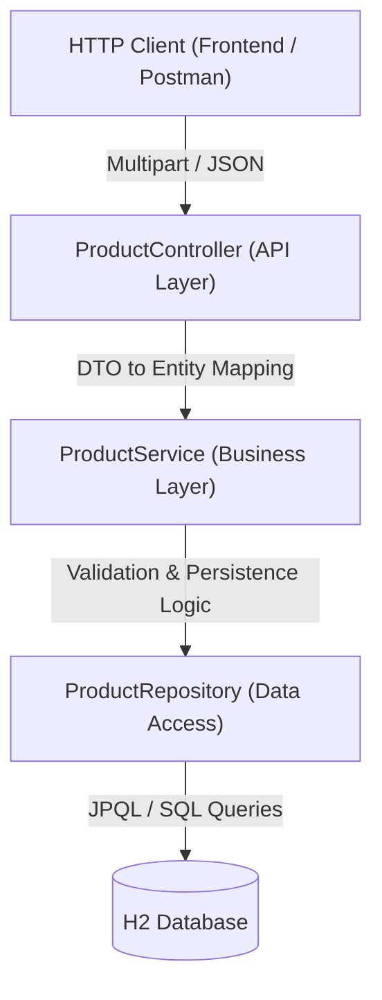

# 🛒 SpringMart Backend

The **SpringMart Backend** is a production-ready REST API built with **Java 21**, **Spring Boot 3.4.5**, and **Spring Data JPA**. It is designed with clean architectural principles, showcasing robust patterns for full-CRUD product catalogs, complex JPA-based search queries, and binary image handling.

---

## 🛠️ Technology Stack

- **Core Framework**: Spring Boot 3.4.5 (Java 21)
- **Database**: H2 (On-disk for development/Docker, transient in-memory option)
- **Persistence**: Spring Data JPA / Hibernate
- **Build Tool**: Apache Maven
- **Containerization**: Docker & Docker Compose
- **Key Libraries**: Lombok, Jakarta Validation (Bean Validation)

---

## 🏛️ Architecture & Layering

The backend is built around a classic layered architecture where each component has a strict, single responsibility. This enables robust decoupling and easier unit testing.



### Layer Roles
1. **API Layer (`ProductController`)**: Manages REST endpoints, HTTP status mappings, and consumes/produces payload representations. Converts incoming `ProductRequest` DTOs to internal entities to keep persistence details private.
2. **Business Layer (`ProductService`)**: Encapsulates transactional business rules, input validation validation triggers, partial merge policies, and binary image stream conversions.
3. **Data Access Layer (`ProductRepository`)**: An abstraction interface extending `JpaRepository` that automates standard CRUD operations and executes optimized JPQL searches.
4. **Domain Model (`Product`)**: The central JPA entity representing the schema of a product in the relational database.

---

## 🔄 Core Request Lifecycles

Understanding how data traverses the application is essential for troubleshooting and extending features. Here are the core request lifecycles:

### 1. Creating a Product
- **Input**: `POST /api/products` as `multipart/form-data` containing a `ProductRequest` JSON part and an optional `imageFile`.
- **Validation**: `@Valid` checks fields on `ProductRequest` (e.g. `@NotBlank` for Name, Category, Brand; `@Min` price).
- **Service Logic**: The service reads the binary image bytes, registers the MIME type, and attaches it to the entity.
- **Persistence**: `ProductRepository.save()` triggers a SQL `INSERT` statement.
- **Output**: Returns `201 Created` with a `Location` header leading to `/api/products/{id}`.

### 2. Updating a Product
- **Input**: `PUT /api/products/{id}`.
- **Service Logic**: 
  - Loads the existing product.
  - Applies a *smart partial merge*: if incoming fields are null, the existing field values are preserved.
  - *Image Preservation*: If no new image file is uploaded, the existing binary image data and meta-information are safely retained.
- **Persistence**: `ProductRepository.save()` detects the existing ID and triggers a SQL `UPDATE` statement.
- **Output**: Returns `200 OK` with the merged and updated entity.

### 3. Case-Insensitive Product Search
- **Input**: `GET /api/products/search?keyword=...`.
- **Logic**: A single, custom JPQL query performs a case-insensitive check across multiple text fields (`name`, `description`, `category`, `brand`) utilizing SQL `LOWER` and `CONCAT('%', :keyword, '%')` operators.
- **Output**: Returns `200 OK` with matching results, or `204 No Content` if no products match.

### 4. Binary Image Retrieval
- **Input**: `GET /api/products/image/{id}`.
- **Logic**: Fetches the product from the database, extracts the stored `imageData` byte array and its `imageType` (MIME).
- **Output**: Streams raw bytes directly to the client with the correct `Content-Type` header (e.g. `image/png`, `image/webp`).

---

## 🐳 Docker Setup & Containerization

The backend is fully containerized using a multi-stage Docker build to minimize production image footprint.

### 1. Build and Run via Docker Compose
From the repository root (where `docker-compose.yml` resides):
```bash
# Build and start the containers
docker-compose up --build
```
This maps port `8080` on the host to `8080` in the container and automatically boots up the backend with the `docker` profile enabled.

### 2. Manual Docker Builds
To build and run the backend container standalone:
```bash
# From the springmart-backend directory
docker build -t springmart-backend .

# Run the container mapping port 8080
docker run -p 8080:8080 springmart-backend
```

### 3. Data Persistence in Docker
H2 database files are kept in the `/app/data` directory inside the container. When utilizing the default `docker-compose.yml`, this is mapped to a host volume (`./data`) to persist your inventory across container restarts.

---

## 💻 Local Developer Workflows

Ensure you run all commands from the `springmart-backend` directory.

### Running the App Locally
To run the Spring Boot application locally with the default profile:
```powershell
# Windows
.\mvnw.cmd spring-boot:run

# Unix/macOS
./mvnw spring-boot:run
```
- **API URL**: `http://localhost:8080`
- **H2 Console**: `http://localhost:8080/h2-console` (JDBC URL: `jdbc:h2:file:./data/springmartdb`, Credentials: `sa`/`password`)
- **Demo Data**: On startup, if the database is empty, `DataLoader` automatically seeds the database with 9 high-quality, realistic demo items.

### Running Automated Tests
The suite uses Mockito for isolated unit testing and standard Spring Boot test runners for smoke testing.
```powershell
# Windows
.\mvnw.cmd test

# Unix/macOS
./mvnw test
```

### Packaging the Application
To compile code and package a standalone, runnable JAR file (skipping test execution):
```powershell
# Windows
.\mvnw.cmd clean package -DskipTests
```
The output runnable JAR will be located under the `target/` directory.

---

## ⚙️ Configuration & Profiles

The application dynamically configures itself based on active Spring profiles:

1. **Default Profile (`application.properties`)**: Enables H2 console, saves database on disk at `./data/springmartdb`, and listens on `8080`.
2. **Docker Profile (`application-docker.properties`)**: Activated via environment variable `SPRING_PROFILES_ACTIVE=docker`. Stores database files at `/app/data/springmartdb`.
3. **Production Profile (`application-production.properties`)**: Standardizes production settings, locks down the H2 console, and configures production CORS origins for the deployed frontend.
